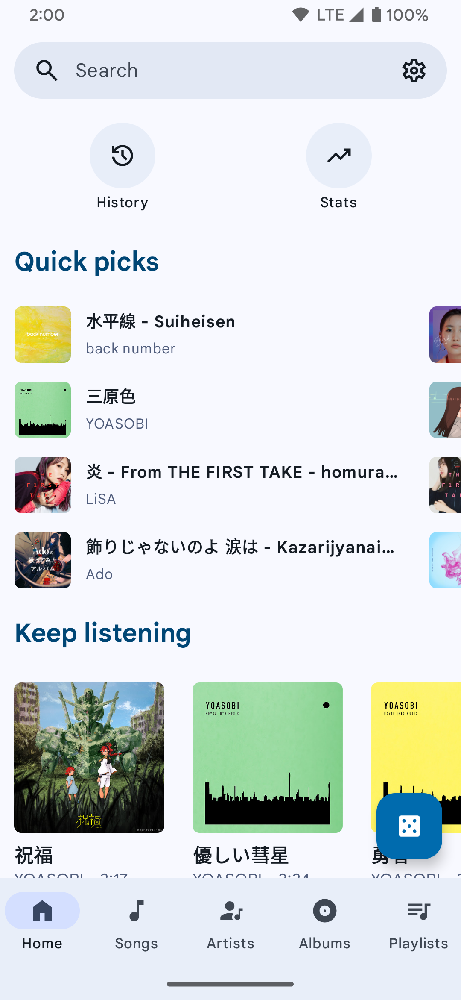
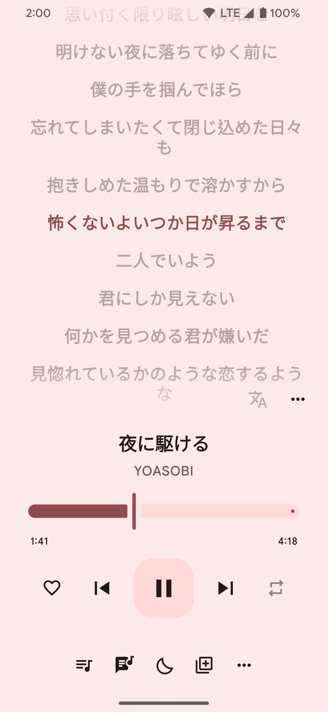
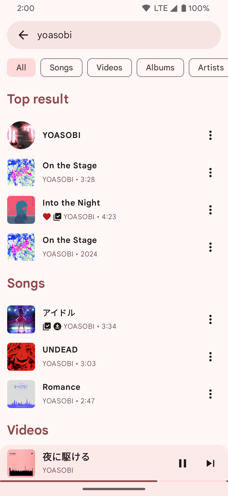
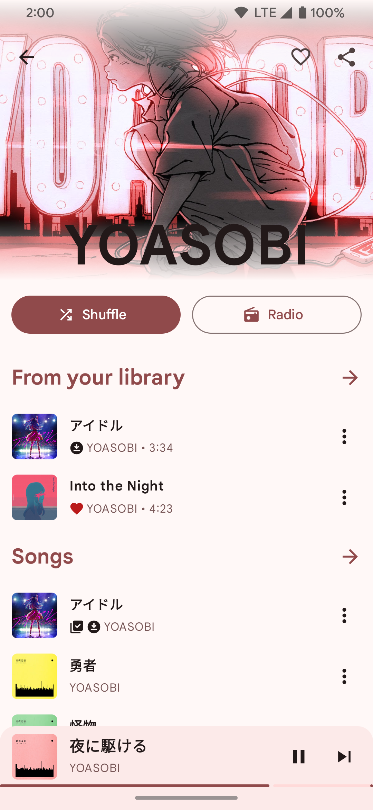
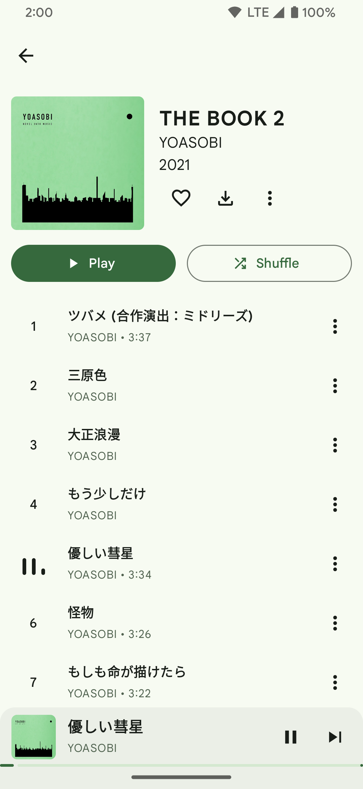

# MusicBites


A Material 3 YouTube Music client for Android — ad-free, offline-capable, and feature-rich.

[](https://github.com/doney-dkp/MusicBites/releases/latest)
[](https://developer.android.com)
[](LICENSE)

---

## Download

Head to the [**Releases page**](https://github.com/doney-dkp/MusicBites/releases/latest) and download the latest `MusicBites-vX.X.X.apk`.

> [!NOTE]
> Enable **"Install from unknown sources"** in your Android settings before installing.

---

## Features

- Play songs from YouTube / YouTube Music without ads
- Background playback with media notification
- Search songs, videos, albums, and playlists
- Login support (YouTube account)
- Cache and download songs for offline playback
- Synchronized lyrics
- Lyrics translator
- Skip silence
- Audio normalization
- Adjust tempo / pitch
- Dynamic Material 3 theme (color extracted from album art)
- Android Auto support
- Personalized quick picks

---

## Screenshots

<table>
  <tr>
    <td></td>
    <td></td>
    <td></td>
  </tr>
  <tr>
    <td></td>
    <td></td>
    <td></td>
  </tr>
</table>

---

## Regional Note

> [!WARNING]
> If you're in a region where YouTube Music is not supported, you won't be able to use this app
> ***unless*** you have a proxy or VPN to connect to a supported region.

---

## How to Build

### Prerequisites

- JDK 17 or higher
- Android SDK (API level 35)
- Gradle (wrapper included — no separate install needed)

### Steps

```bash
# Clone the repository
git clone https://github.com/doney-dkp/MusicBites.git
cd MusicBites

# Debug build (no signing required)
./gradlew assembleDebug

# FOSS debug build (no Firebase/Google services)
./gradlew assembleFossDebug

# Full debug build (with Firebase Analytics, Crashlytics, ML Kit)
./gradlew assembleFullDebug
```

Output APKs are located at:
```
app/build/outputs/apk/<flavor>/<buildType>/
```

### Release Builds

Release builds require signing keys passed via environment variables:

```bash
export MUSIC_RELEASE_SIGNING_STORE_FILE=path/to/your.jks
export MUSIC_RELEASE_SIGNING_STORE_PASSWORD=...
export MUSIC_RELEASE_SIGNING_KEY_ALIAS=...
export MUSIC_RELEASE_SIGNING_KEY_PASSWORD=...

./gradlew assembleFossRelease    # F-Droid compatible
./gradlew assembleFullRelease    # With Firebase services
```

### Build Flavors

| Flavor | Description |
|--------|-------------|
| `foss` | F-Droid compatible — excludes Firebase, Crashlytics, and ML Kit |
| `full` | Includes Firebase Analytics, Crashlytics, Performance Monitoring, and ML Kit |

---

## FAQ

### Q: How do I scrobble music to LastFM, LibreFM, ListenBrainz or GNU FM?

Use a dedicated scrobbler app. [Pano Scrobbler](https://play.google.com/store/apps/details?id=com.arn.scrobble) is recommended.

### Q: Why isn't MusicBites showing in Android Auto?

1. Open Android Auto settings and tap the version number several times to unlock developer settings.
2. Tap the three-dot menu at the top-right → **Developer settings**.
3. Enable **"Unknown sources"**.

---

## Credits & Acknowledgements

- [vfsfitvnm/ViMusic](https://github.com/vfsfitvnm/ViMusic) — an excellent Jetpack Compose music player that served as a learning reference for building this app.
- [Claude](https://claude.ai) by [Anthropic](https://anthropic.com) — AI assistant that helped me throughout the development of MusicBites, my first Android project. A huge thank you to Claude for the guidance, debugging help, and code suggestions that made this project possible.

---

## Disclaimer

This project and its contents are not affiliated with, funded, authorized, endorsed by, or in any way associated with YouTube, Google LLC, MusicBites Media Inc., or any of its affiliates and subsidiaries.

Any trademark, service mark, trade name, or other intellectual property rights used in this project are owned by the respective owners.
